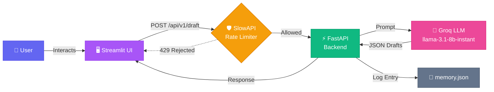

# ✍️ Tone-Adjusted Reply Drafter

An AI-powered tool that takes a received message and instantly generates **three tone-adjusted reply drafts** — so you can pick the voice that fits the moment.

Built with **FastAPI** on the backend, **Streamlit** on the frontend, and **Groq (LLaMA 3.1 8B)** as the AI engine.

---

## 🌐 Live Demo

| Service  | URL |
|----------|-----|
| **Frontend** (Streamlit Cloud) | [month-01-sprint-b-projects-4lmf8gzokygude26acsdzj.streamlit.app](https://month-01-sprint-b-projects-4lmf8gzokygude26acsdzj.streamlit.app/) |
| **Backend API** (Render) | [month-01-sprint-b-projects.onrender.com](https://month-01-sprint-b-projects.onrender.com/) |

> **Note:** The backend is hosted on Render's free tier, so the first request after a period of inactivity may take ~30–50 seconds due to cold start.

---

## 🏗️ System Architecture



### Flow Summary

1. **User** enters a received message, context/goal, and 3 desired tones in the Streamlit UI.
2. **Streamlit** sends a `POST` request to the FastAPI backend.
3. **SlowAPI** intercepts the request and enforces a **5 requests/minute** rate limit.
4. **FastAPI** constructs a structured prompt and sends it to the **Groq API** (LLaMA 3.1 8B Instant).
5. The LLM returns a JSON object with 3 tone-adjusted reply drafts.
6. FastAPI **logs** the request and response to `memory.json` for lightweight persistence.
7. The drafts are returned to Streamlit and displayed in styled, copyable cards.

---

## 📡 API Endpoint

### `POST /api/v1/draft`

**Request Body:**

```json
{
  "message": "Hey, can you finish the report by tomorrow morning?",
  "context": "Politely ask for a deadline extension",
  "tones": ["Professional", "Gen-Z", "Passive-Aggressive"]
}
```

| Field     | Type       | Required | Description                                      |
|-----------|------------|----------|--------------------------------------------------|
| `message` | `string`   | ✅       | The received message to reply to                 |
| `context` | `string`   | ✅       | The goal or intent of the reply                  |
| `tones`   | `string[]` | ✅       | Exactly 3 tone labels for the generated drafts   |

**Response Body:**

```json
{
  "drafts": {
    "Professional": "Thank you for flagging the deadline. I want to ensure the report meets our quality standards — would it be possible to extend the deadline to end of day tomorrow?",
    "Gen-Z": "bet, i hear you — but ngl that timeline is kinda tight 😅 any chance i can get till EOD tomorrow? wanna make sure it slaps fr",
    "Passive-Aggressive": "Oh, tomorrow morning? Sure, I'll just cancel my evening plans and work through the night. Or, you know, we could set a realistic deadline."
  }
}
```

**Error Responses:**

| Status | Meaning                         |
|--------|---------------------------------|
| `200`  | Success — drafts returned       |
| `422`  | Validation error (bad payload)  |
| `429`  | Rate limit exceeded (5/min)     |
| `500`  | Internal server error           |

---

## 🛠️ Tech Stack

| Layer         | Technology                     |
|---------------|--------------------------------|
| Frontend      | Streamlit                      |
| Backend       | FastAPI + Uvicorn              |
| Rate Limiting | SlowAPI                        |
| AI Model      | Groq — `llama-3.1-8b-instant` |
| Logging       | Local `memory.json` file       |
| Env Mgmt      | python-dotenv                  |

---

## 🚀 Getting Started

### 1. Clone & Navigate

```bash
git clone https://github.com/PixelProgrammer4209/month-01-sprint-B-projects.git
cd month-01-sprint-B-projects/Sooraj-K-R
```

### 2. Create a Virtual Environment

```bash
python -m venv venv
source venv/bin/activate
```

### 3. Install Dependencies

```bash
pip install -r requirements.txt
```

### 4. Set Up Environment Variables

Create a `.env` file in the project root:

```
GROQ_API_KEY=your_groq_api_key_here
```

> Get your free API key at [console.groq.com](https://console.groq.com)

### 5. Run the Backend

```bash
uvicorn backend:app --reload
```

The API will be available at `http://127.0.0.1:8000`. Interactive docs at `http://127.0.0.1:8000/docs`.

### 6. Run the Frontend (separate terminal)

```bash
streamlit run frontend.py
```

The Streamlit UI will open at `http://localhost:8501`.

---

## 📁 Project Structure

```
Sooraj-K-R/
├── backend.py          # FastAPI server with Groq integration
├── frontend.py         # Streamlit UI with error handling
├── memory.json         # Auto-generated request/response log
├── requirements.txt    # Python dependencies
├── .env                # API keys (git-ignored)
├── .gitignore          # Excludes .env, __pycache__, venvs
└── README.md           # This file
```

---

## ⚠️ Error Handling

The frontend implements robust error handling for:

- **Backend offline** — Friendly connection error with instructions to start Uvicorn
- **Rate limit (429)** — Clear message explaining the 5 req/min limit
- **Timeout** — 30-second timeout with retry suggestion
- **Invalid JSON** — Catches malformed API responses
- **Empty inputs** — Client-side validation before API call
- **Duplicate tones** — Warns users to pick 3 distinct tones
